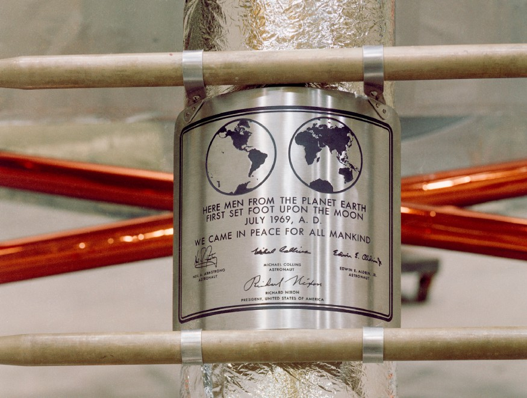
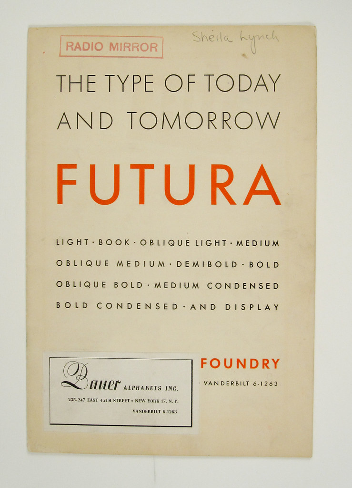

Whether we know it or not, the **Futura** typeface will have crossed our paths many times in our life. It is seen in popular modern brand logos like Supreme, Red Bull and Paypal, but its most common use has been within history, most notably featured on the **Apollo 11 moon landing**, and in 20th century Germany, Futura's birthplace.

Like its name suggests, German-born designer **Paul Renner** created Futura as a modern and futuristic sans-serif typeface, much different to the traditional serif styles fonts of the early 1900's. It was used abundantly by modern art pioneers at Bauhaus to reflect positive social change, democracy and revolt until its closure in 1933, prompted by the uprise in German Nazism.

Because of the modernist context Futura had, it gave the Nazis the opportunity to create a motif for change with the typeface. While this gave it plenty of negative connotations, Futura is still open to interpretation by those who choose to use it. The goal of using a typeface is to elicit a specific emotional response from the consumer, so it makes sense that it was commonly used in fascist propaganda because it was established as a symbol for social change.

Fortunately, Futura was not wiped out completely by it's popularity within Nazi propaganda. 1940's Germany saw the rise in a typeface already with nationalistic ties named **Fraktur**, which has subsequently been banned in Germany due to its intense connection with fascist propaganda.

Due to its links with fascist propaganda, graphic designers often warn others to steer clear from Futura. Despite this, it is still seen today to represent what it was initially created for: a vision for the future.