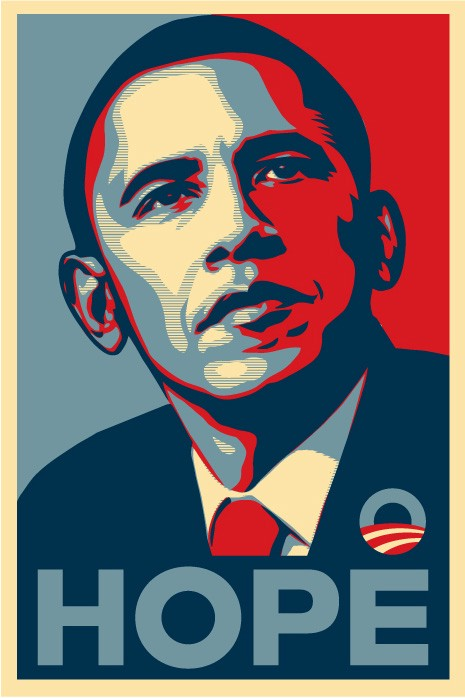
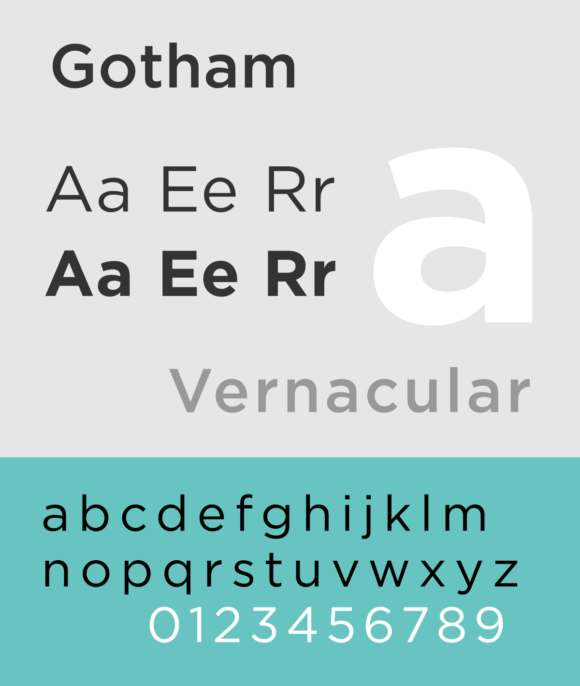

We’ve all seen the iconic “Hope” poster, depicting Barack Obama in posterized red, white and blue, but few know its origin, or the story of “Gotham”, the chosen typeface.

Gotham is a classic, simple and striking typeface used widely in bold and memorable brand logos such as Coca-Cola, Spotify and Netflix. It was created by famous typographers Jonathan Hoefler & Tobias Frere Jones (now known as Hoefler & co.), who were commissioned by GQ magazine to create a new font for their logo. Frere Jones filed a lawsuit against Hoefler not so long after the creation of Gotham and accused him of cheating him out of half their shared company. Frere Jones claimed he was “duped” into transferring ownership of several fonts, and in 2014 they eventually reached an out of court settlement.

“Hope”, featuring Gotham, was an art piece created by Shepard Fairey, initially as a street poster, but later became so popular it was later distributed as merchandising, and eventually adapted by the Obama campaign itself. Fairey was a political artist, who used her medium to criticize Bush’s America before the 2008 election. The infamous poster design was inspired by a popular photograph of John F. Kennedy.

This piece of political art is clever in that it combines old and new styles of design to appeal to as many people as possible. The choice of a bold sans-serif font and using the word “hope” appeals to the younger generation- combining modern design ideas to offer a better future. The use of the classic reds and blues harkens back to traditionalism and Americana, and the stencil print style also offer that essence of traditional value. This appeals to an older voter, or voters who live outside of urban areas.

While the “Hope” campaign aided in popularising Gotham, it is a typeface almost destined to exist within our daily lives. Its high legibility and orderly boldness make it a branding favourite amongst digital platforms, drinks bottles, and political campaigns.