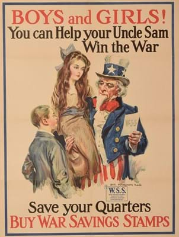
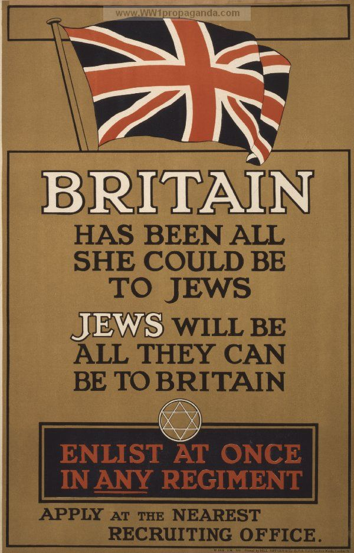

War is an inherently fascist idea. Often it is used as an example for how fascism manifests itself in society. It is the idea of nostalgia, success, and patriotism. If it were not for the carefully articulated text and design of war propaganda, people would be more pacifist. It is important to understand and explore the way propaganda is crafted to pick it apart and decide whether our views truly match up with what we are being fed.

The idea, when it comes to this style of propaganda, is to tailor to traditionalist ideologies. Have a look at some of the traits of right-wing politics:

* Blaming other races, nations, religions, and other groups for the problems within your country
* Nationalistic views and superiority of your own country/nation
* Focusing on the past and the need to return to those “greater” stages
* Dislike towards creative industries and arts (which is ironic, considering the arts are needed in order to create propaganda)

All these characteristics can be converted into design through colour, text, and imagery.

The easiest way to portray traditionalist values in a piece of propaganda is to use a bold serif font. Typefaces like Baskerville bode well in these types of design, as Baskerville is widely recognised as a legible and “trustworthy” typeface.

Using illustrations in propaganda is also a popular tactic as there are endless opportunities to fabricate a reality with an illustration, more so than with a photograph. Illustrations were also the imagery of choice in world war propaganda in Britain. If one were to use a photograph, using manual print methods like screen printing also gives a historical or “vintage” feeling to a design.

Make sure illustrations clearly feature soldiers and military figures as heroes and elevate their status. This technique is evident whenever referring to a less glamorous, low salaried and laborious job, just like how we see the NHS being portrayed during the COVID-19 pandemic.

To play to an audience’s patriotic values, using colours and symbolism with an association to a country is key. The most memorable pieces of propaganda use these tactics. For example, stars and stripes, and red/white/blue colour schemes are popular within American propaganda.

21st Century propaganda doesn't manifest itself as obliviously as world war campaigns did back in the 1900's, however that is not to say these design attributes are still used in propaganda. In the present day, algorithm-based online advertising is a common form of propaganda. That alongside social media driven misinformation are incredible hubs of propaganda full of passion and emotion, which many far-right leaders play on in order to get their way in politics.

In conclusion, the main elements that make up a piece of “successful” war propaganda are easily manifested into a piece of design. Focusing on a nationalist colour schemes as well as traditional typefaces and illustration techniques are a simple yet effective way to catch the eye of conservative members of the electorate.