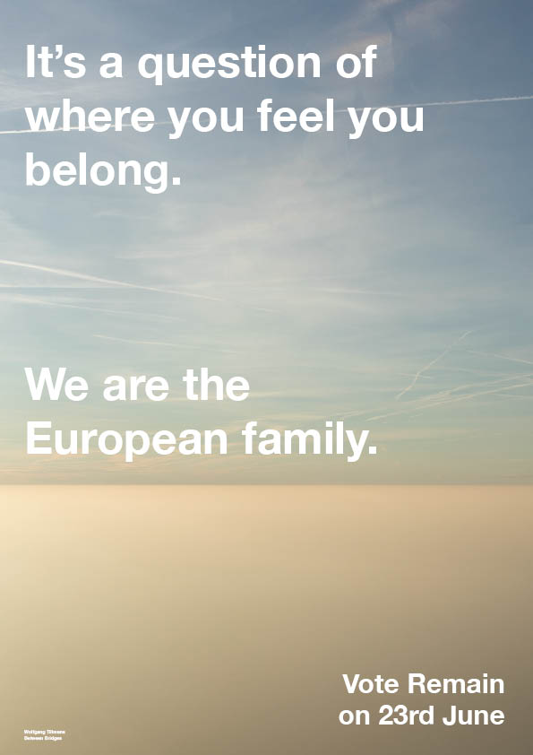
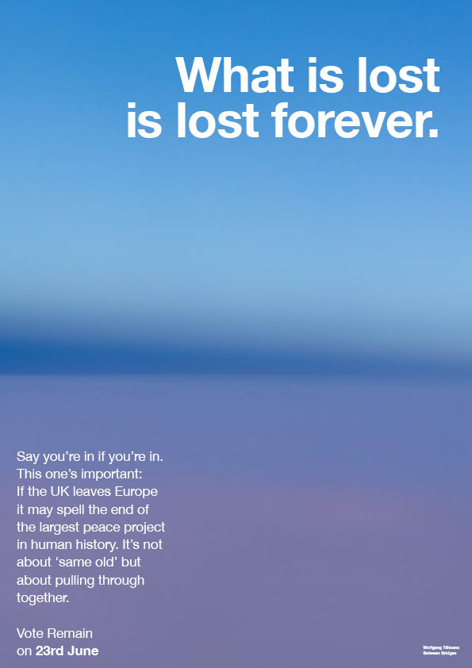

Ah, yes. Good old Brexit. I haven’t thought about the catastrophe that has been Britain’s clunky exit from the EU in a while, and frankly, it’s felt rather tranquil having it off my mind. Instead of fretting about the complications it presents us with- let’s take a moment to analyse the design techniques used in both the remain and leave campaigns from 2015.

Surprisingly, both campaigns were similar in design structure. Both used colours representative of the Union Jack, and both stuck to bold and legible sans-serif font families. Both campaigns also chose a minimalist approach, keeping the main campaign posters and advertisements focused on the words, minimizing the number of images and colours used.

The aim of the campaign was to swing voters to the other side politically speaking, so the Vote Leave campaign stuck to focusing on reds to appeal to labour voters, and the remain campaign (known as Stronger In) chose to centre their advertising around blues, to draw attention to conservative voters, as well as Scottish voters too.

Bright and saturated red in combination with stark, white text was a smart move on the Vote Leave campaign, as their advertising stood out intensely, even when amongst other posters and billboards.

## **Wolfgang Tillmans**

As part of the pro-EU campaign, German Photographer Wolfgang Tillmans produced a series of photograph-based posters that were distributed around the UK. The photographs used were representative of different aspects of the UK’s relationship with Europe and the EU, such as the view outside the window of an airplane, or the European Union flag.

Tillmans uses Helvetica Neue bold as his typeface of choice. Helvetica Neue is a popular font, good for a minimalistic design. It was created in 1957, inspired by Swiss Design. Because of its neutrality and legibility, it is often seen in publications and print design, just like Tillmans’ campaign posters.

These designs have a clear message and are easy upon the eye, however they blend into the background, and carry only an essence of what the campaign is arguing. In comparison to Vote Leave’s statistics printed onto the side of a big red bus, the campaign for remaining in the EU fell short.