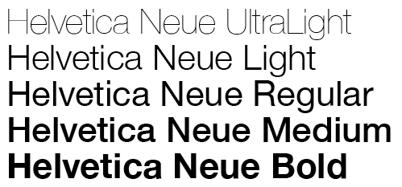

Typefaces have more of an agenda than we may want to believe. Each line and curve that makes up a font carries a meaning. This collection of articles aims to give readers a better understanding as to how typefaces influence politics and breathe new life into historical and modern propaganda.

Within this website, the typographical and design choices I have made are all deliberate. I have chosen to use Helvetica Neue (bold) in my logo and banner design. Helvetica Neue is a popular typeface choice because of its neutrality (and it is a personal favourite of mine!). It harkens back to the minimalism of International Typographic Style (Swiss design, etc) and the Bauhaus movement, inviting modern, futuristic ideas while maintaining simplicity. I chose to keep the boldness to signify the titled elements of the blog.

The typeface used in the actual website is Josefin Sans Pro. I chose to use the same typeface in both the headings and body, in order to not overwhelm the reader by using too many fonts.

I chose to keep the background a light grey to offset the brightness of the whites in the main body of the website in order to be easier on the eye. Red and deep blue are the main colour motifs of the blog, in order to keep the political theme prevalent. I made the decision to use a darker blue and a slightly less vibrant red, however, in order not to non-verbally shout at any readers through the screen; I wanted to keep this blog as neutral and inviting as possible, as discussing politics is often a heavy topic.